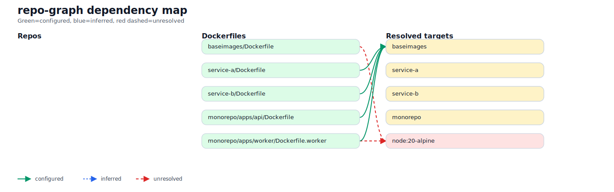

# repo-graph

A CLI tool for discovering Docker image dependencies across multiple repositories and rendering them as a graph.

## Product Summary

`repo-graph` scans one or more repositories, finds Dockerfiles, parses image relationships, resolves internal image ownership where possible, and produces outputs that help answer questions like:

- Which services depend on a shared base image?
- What does a given service depend on?
- Which image references are unresolved or only inferred?
- What would be impacted by changing a base image?

The goal for V1 is a practical, trustworthy dependency graph for Docker-based repos and monorepos.

## Problem

Teams often maintain multiple services and base images spread across several repositories. Dependency relationships are hard to understand because:

- Dockerfiles are distributed across many repos
- internal images may be built in one repo and consumed in another
- monorepos may contain many Dockerfiles for different services
- multi-stage Dockerfiles can create false positives
- image references may be dynamic via `ARG` substitution

Without a clear graph, it is difficult to assess impact, standardize base images, or identify outdated dependencies.

## Goals

V1 should:

- scan 5–10 repositories reliably
- discover Dockerfiles across normal repos and monorepos
- parse image dependencies from Dockerfiles
- distinguish real image dependencies from multi-stage aliases
- resolve at least simple `ARG`-based `FROM` substitutions
- support multiple graph views
- mark confidence levels for mappings
- output machine-readable and human-readable reports

## Non-Goals for V1

These are valuable but not required for the first useful release:

- full Dockerfile evaluation parity with Docker BuildKit
- deep CI/CD pipeline analysis
- automatic verification of published tags across registries
- dependency remediation or automatic updates

## Core Requirements

### 1. Dockerfile parsing

The parser must support at least:

- `ARG`
- `FROM`
- `AS`

It should resolve simple default substitutions such as:

```Dockerfile
ARG BASE=node:20-alpine
FROM ${BASE}
```

### 2. Multi-stage build awareness

A stage alias is not an external image dependency.

Example:

```Dockerfile
FROM node:20-alpine AS builder
FROM builder AS final
```

`builder` must not be treated as an image dependency in the second `FROM`.

### 3. Monorepo support

A repository may contain many Dockerfiles representing many services.

The graph must support:

- repo-level view
- dockerfile/service-level view

### 4. Trustworthy resolution states

Every internal image mapping should carry a confidence/status indicator:

- `configured` — explicitly mapped in config
- `inferred` — inferred by heuristics
- `unresolved` — could not be mapped confidently

This is required to avoid false confidence.

## Recommended UX

### Commands

```bash
repo-graph scan repos.yaml --out ./output
repo-graph scan repos.yaml --out ./output --refresh
repo-graph scan repos.yaml --out ./output --cache-dir ./.cache/repos
repo-graph report ./output/graph.json
repo-graph report ./output/graph.json --format markdown > dependency-report.md
repo-graph render ./output/graph.json --format mermaid > dependency-graph.mmd
repo-graph render ./output/graph.json --format dot > dependency-graph.dot
repo-graph render ./output/graph.json --format svgrepos > dependency-graph.svg
```

### Helpful flags

- `--focus baseimages`
- `--depth 2`
- `--include-external`
- `--exclude-external`
- `--view repo|dockerfile|image`
- `--cached`
- `--refresh`

## Example Questions the Tool Should Answer

### Who depends on `baseimages`?

```text
baseimages
├── service-a
├── service-b
└── service-c
```

### What does `service-a` depend on?

```text
service-a
└── ghcr.io/ingeniator/base-node:18
└── node:20-alpine
```

### What is unresolved?

```text
Unresolved image ownership:
- mycorp/internal-tools:latest
- ${BASE_IMAGE}
```

## Architecture Direction

Recommended implementation choices:

- CLI application
- TypeScript
- YAML config
- explicit image ownership mapping in config
- graph output focused on repo/image relationships
- Mermaid output for easy visualization
- clone/cache support for GitHub and generic git remotes via `.cache/repos`

This is the best usefulness-to-complexity tradeoff for V1.

## Minimal Implementation Order

1. Config loader
2. Repo clone/update cache
   - example cache dir: `.cache/repos/<repo-name>`
3. Dockerfile discovery
4. Simple parser for:
   - `ARG`
   - `FROM`
   - `AS`
5. Graph model
6. JSON output
7. Mermaid renderer
8. Text report
9. Focus/filter options

That sequence is enough for a useful first release.

## Repo Sources and Cache

Each repo can now be defined as one of:

- local path via `path`
- GitHub shorthand via `github: owner/repo`
- explicit git remote via `git`

Optional fields:

- `ref` — branch or tag to check out
- `settings.cacheDir` — where cloned repos are stored
- `repo-graph scan --refresh` — fetch updates for cached repos before scanning
- `repo-graph scan --cache-dir <dir>` — override cache location for a run

Example:

```yaml
repos:
  - name: service-a
    github: Ingeniator/service-a
    ref: main

  - name: service-b
    git: git@github.com:Ingeniator/service-b.git
    ref: main

  - name: local-dev
    path: ../service-local

settings:
  cacheDir: ./.cache/repos
```

## Output Requirements

V1 should produce:

- JSON graph
- Mermaid diagram
- readable text summary/report
- Markdown report suitable for docs/PRs/wiki pages

## Example Output

A checked-in example generated from the local fixture set is available in:

- `examples/fixture-output/graph.json`
- `examples/fixture-output/report.txt`
- `examples/fixture-output/dependency-graph.mmd`
- `examples/fixture-output/dependency-graph.dot`
- `examples/fixture-output/dependency-graph.svg`

Preview:



The source fixture lives in `test/fixtures/`.

Refresh the checked-in example files with:

```bash
npm run fixture:generate-examples
```

## Tests

The local fixture is also used as an automated snapshot-style test suite.

Run:

```bash
npm test
```

Refresh snapshots intentionally with:

```bash
npm run snapshots:update
```

Current snapshots cover:

- stabilized `graph.json`
- text report
- Markdown report
- Mermaid output
- DOT output
- `svgrepos` SVG output

## Definition of Done for V1

V1 is successful if it can:

- scan 5–10 repos
- correctly detect Dockerfiles
- resolve at least 80% of internal image links
- produce JSON, Mermaid, and readable summary output
- reliably answer: “which services depend on baseimages?”

If it can do that consistently, it is already useful.

## Future Enhancements

Possible next steps after V1:

- parse GitHub Actions to discover actually built/pushed tags
- detect base image drift across services
- visualize staleness of dependencies
- estimate change impact from base image updates
- integrate Renovate/Dependabot data
- richer Markdown/HTML documentation layouts

## Naming

Reasonable names considered:

- `repo-graph`
- `dockerlineage`
- `image-map`
- `dockertree`
- `baseimage-radar`
- `image-lineage`

Recommended choice: `repo-graph`.
